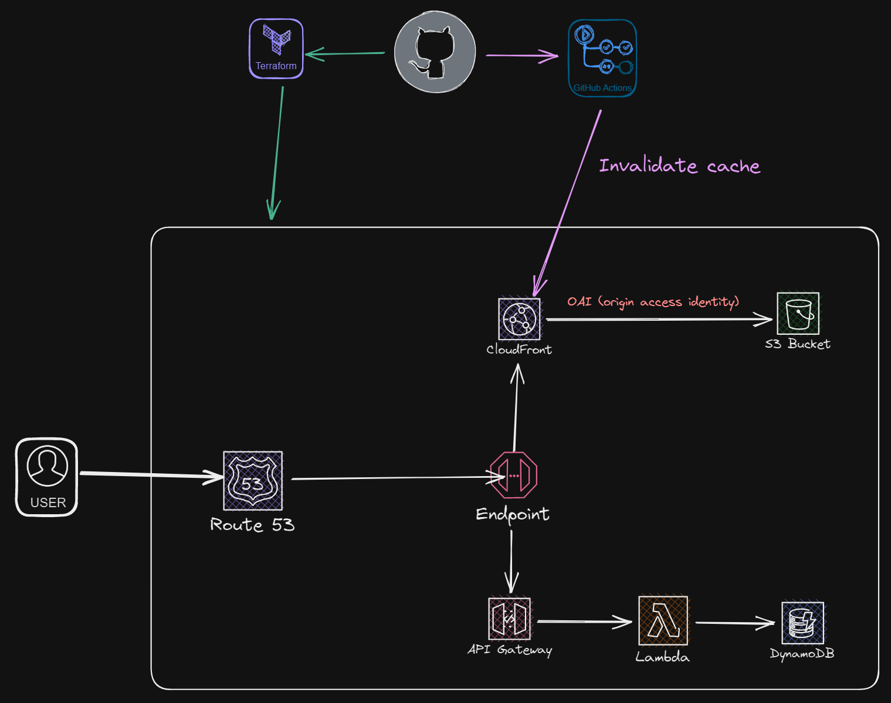

# Cloud Resume Challenge Project
This project is inspired by the Cloud Resume Challenge, a hands-on project designed to help individuals learn and demonstrate their cloud skills. The project involves deploying a static website hosted on AWS S3, secured with CloudFront and an Origin Access Identity (OAI), and integrated with an API Gateway and Lambda function to track and increment visitor counts. Additionally, the project uses Terraform for infrastructure as code (IaC) to deploy and manage all AWS resources, and GitHub Actions for CI/CD to automate cache invalidation and ensure the website is always up-to-date.

## Features
Static Website Hosting: The website is hosted on an S3 bucket, with access restricted to requests coming through CloudFront using an Origin Access Identity (OAI).

Visitor Counter: An API Gateway triggers a Lambda function to retrieve and increment the number of visitors, which is stored in a DynamoDB table.

DNS Management: Amazon Route 53 is used to manage the domain name and route traffic to the CloudFront distribution.

Infrastructure as Code (IaC): Terraform is used to define, deploy, and manage all AWS resources, ensuring consistency and reproducibility.

CI/CD Pipeline: GitHub Actions automatically deploys changes to the S3 bucket and invalidates the CloudFront cache whenever updates are pushed to the Front-end directory.

## License
This project is licensed under the [Apache License V2](LICENSE).