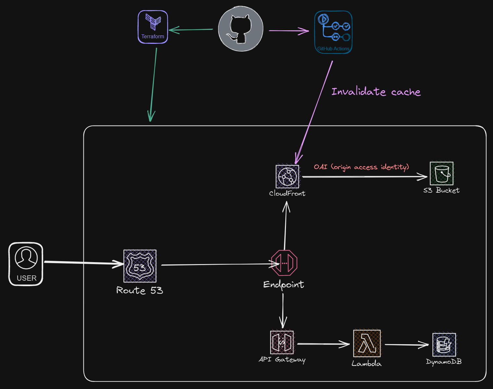

# Cloud Resume Challenge – Serverless Portfolio Website

Personal portfolio website with real-time visitor counter, fully deployed and automated on AWS using Infrastructure as Code (Terraform) and CI/CD (GitHub Actions).

This was my **second cloud project** — after the Minecraft Server (first Terraform + EC2) and before ZeeURL (Kubernetes + GitOps full-stack).  
It helped me master serverless patterns, secure static hosting, and automated deployment.

Live demo: [https://zeeward41.com](https://zeeward41.com)  
GitHub repo: [zeeward41/cloud_resume_challenge](https://github.com/zeeward41/cloud_resume_challenge)

## Features

- Static website hosted on **S3** + **CloudFront** (HTTPS + global CDN)
- Bucket fully private via **Origin Access Identity** (OAI)
- Visitor counter powered by **API Gateway** + **Lambda** (Python) + **DynamoDB**
- Custom domain & DNS routing via **Route 53**
- Infrastructure fully defined with **Terraform** (modular structure)
- Automatic deployment & CloudFront cache invalidation via **GitHub Actions**

## Tech Stack

| Layer             | Technologies                         |
| ----------------- | ------------------------------------ |
| Frontend          | HTML • CSS • JavaScript (vanilla)    |
| Backend / Counter | AWS Lambda (Python) • API Gateway    |
| Storage           | Amazon S3 (static hosting)           |
| Database          | DynamoDB (visitor count)             |
| CDN / Security    | CloudFront + Origin Access Identity  |
| DNS               | Route 53                             |
| IaC               | Terraform (modules + remote backend) |
| CI/CD             | GitHub Actions (sync + invalidate)   |

## Architecture

1. User → Route 53 → CloudFront → S3 (static site)
2. Visitor counter: JavaScript fetch → API Gateway → Lambda → DynamoDB (GET + POST increment)
3. All infra provisioned via Terraform
4. Push to `Front-end/` → GitHub Actions → S3 sync + CloudFront invalidation

## How to Explore

Not designed for easy local reproduction (requires AWS account, domain, Terraform state backend, etc.).

To understand:

1. Check the architecture diagram above
2. Review Terraform modules: `Infrastructure/modules/`
3. Review CI workflow: `.github/workflows/update_front-end.yml`
4. See the simple frontend: `Front-end/`

## Why I Built It

Goal: apply AWS fundamentals in a real, public project:

- Secure static hosting (S3 + CloudFront + OAI)
- Serverless backend (API Gateway + Lambda + DynamoDB)
- IaC with Terraform
- Basic CI/CD automation

After this, I moved to **ZeeURL** — a full-stack application with Kubernetes, GitOps, hybrid CI (GitHub Actions + self-hosted Jenkins), and distributed ID generation.

## License

[Apache License 2.0](LICENSE)

**Personal note**  
100% solo project during career transition (2024).  
Second step after Minecraft Server (first Terraform), before ZeeURL.  
AWS Certified Solutions Architect – Associate.

